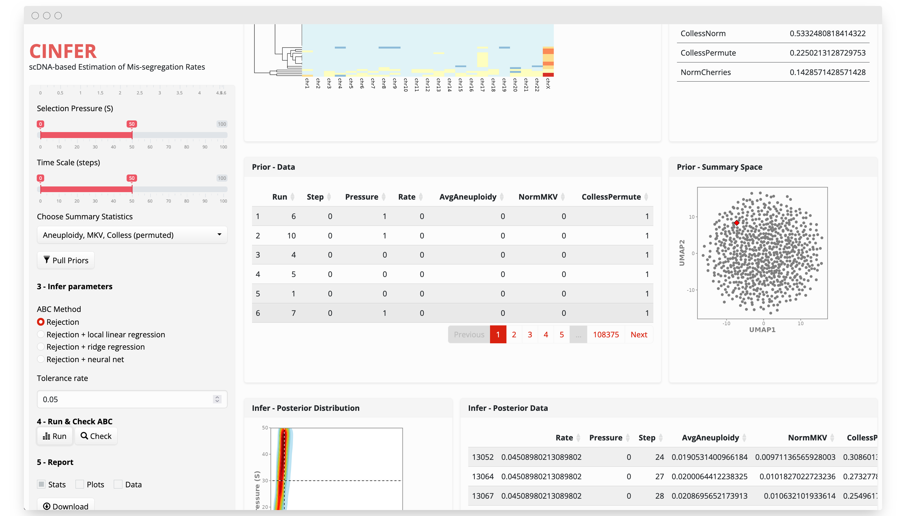

<!-- README.md is generated from README.Rmd. Please edit that file -->

```{r, include = FALSE}
knitr::opts_chunk$set(
  collapse = TRUE,
  comment = "#>",
  fig.path = "man/figures/README-",
  out.width = "100%"
)
```

<p align="center">


</p>

# CINFERcli

CINFER produces scDNAseq-based estimates of chromosome mis-segregation rates. It uses a pre-simulated dataset of over 50,000 simulated populations growing with varying levels of chromosomal instability and selective pressure of aneuploid populations.

We have shown that this method can recall experimentally observed mis-segregation rates as well as those most likely to have resulted in the karyotype diversity observed in patient-derived clinical samples.

## Installation

```         
devtools::install_github('andrewrlynch/CINFERcli')
```

# Usage

If you use CINFER, kindly cite:

> Lynch, Andrew R., Nicholas L. Arp, Amber S. Zhou, Beth A. Weaver, and Mark E. Burkard. Quantifying chromosomal instability from intratumoral karyotype diversity using agent-based modeling and Bayesian inference. Elife 11 (2022): e69799.

## Usage

### Web App

A [web version](https://burkardlab.shinyapps.io/CINFER/) of CINFER is available for ease of use. It implements a subset of CINFERbase which includes:

-   A stabilizing karyotype selection model selecting against cells with imbalanced karyotypes.

-   A exponential/pseudo-Moran growth model that rapidly approaches, and is capped at 3000 cells.

-   Lower mis-segregation rates relevant to natural biological processes.

<p align="center">

{width="auto" height="512"}

</p>

## 

### Citation

If you use CINFER, kindly cite:

> Lynch, Andrew R., Nicholas L. Arp, Amber S. Zhou, Beth A. Weaver, and Mark E. Burkard. Quantifying chromosomal instability from intratumoral karyotype diversity using agent-based modeling and Bayesian inference. Elife 11 (2022): e69799.
